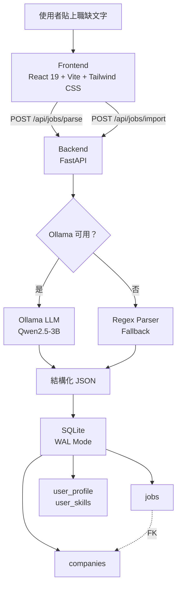

<p align="center">
  
</p>

<h1 align="center"><b>Find</b>YourJob</h1>

<p align="center">
  本地優先的職缺整理工具——貼上職缺文字，AI 萃取結構化資料，比較你的所有機會。<br/>
  <i>A local-first job aggregation tool. Paste job postings, extract structured data via local LLM, compare all your opportunities. Your data never leaves your machine.</i>
</p>

<p align="center">
  
  
  
  
  
  
  
</p>

---

<!-- 截圖待補：請將截圖放入 screenshots/ 目錄後取消註解

<p align="center">
  
</p>

<p align="center">
  
  
</p>

<p align="center">
  
</p>

-->

## 核心功能 Core Features

| | 功能 | 說明 |
|---|---|---|
| **AI 文字萃取** | AI Text Extraction | 貼上職缺原文，本地 LLM（Ollama + Qwen2.5-3B）自動萃取 20+ 結構化欄位 |
| **雙軌輸入** | Dual-Track Input | 不能跑 Ollama？複製 prompt 給 ChatGPT / Gemini / Claude，貼回 JSON 即可——任何 LLM 都能用 |
| **結構化比較** | Structured Comparison | 可排序表格：薪資、技能匹配度、投遞狀態、城市篩選，在你自己的資料集內相對排名 |
| **技能匹配** | Skill Matching | 技能自動從職缺聚合，分三級（已會 / 可補強 / 未分類），計算每筆職缺的匹配分數 |
| **公司管理** | Company Management | 共享福利 / 聯絡人 / 面試筆記，三層公司名稱正規化（字串前處理→模糊比對→語意搜尋） |
| **條件比對** | Mismatch Detection | 設定個人條件後自動比對，警告但不隱藏——使用者永遠自己決定 |
| **欄位溯源** | Field Provenance | 每個欄位追蹤來源（LLM / 匯入 / 手動）與完整編輯歷史，非破壞性資料補充 |
| **完全離線** | Fully Offline | SQLite 單檔、無雲端 API、無帳號、資料不離開你的電腦 |

---

## 技術架構 Architecture

### 系統架構



### 關鍵技術決策

| 決策 | 做法 | 為什麼 |
|------|------|--------|
| **Schema-Driven Prompts** | Pydantic `Field(description=...)` 自動生成 LLM prompt | 新增欄位改一處，prompt 自動更新。`llm_parser.py` 從 183 行簡化到 90 行 |
| **三層公司正規化** | 字串前處理 → rapidfuzz 模糊比對 → embedding 語意搜尋 | 每層都是可選的。沒裝 rapidfuzz？跳過。沒裝 sentence-transformers？跳過。系統永遠可運行 |
| **欄位溯源** | 每個欄位追蹤 `source`（llm/import/user）和 `updated_at` | 非破壞性補充：填空不覆蓋，衝突交由使用者選擇 |
| **Fallback-First** | Ollama → regex parser → 手動輸入 | 系統不依賴任何單一元件，永不中斷 |
| **結構化福利** | 6 大類對齊 104/1111 人力銀行格式 | 讓福利可跨職缺比較，而非自由文字 |
| **自動遷移** | `init_db()` 啟動時檢查 `PRAGMA table_info()` 並新增缺少欄位 | 零停機 schema 演進，舊版資料庫自動升級 |

### 程式碼亮點：Schema 驅動的 Prompt 生成

```python
# backend/extraction_schema.py — Pydantic model 即 prompt 的單一來源

class JobExtraction(BaseModel):
    """每個 Field(description=...) 同時是資料驗證規則和 LLM prompt 指令。"""
    title: str = Field(description="職位名稱（必填）")
    salary_min: Optional[int] = Field(None, description="最低薪資數字（50K→50000）")
    skills: Optional[str] = Field(None, description="技能需求，逗號分隔")
    # ... 20+ fields, 新增欄位只需加一行

def _build_template_body() -> str:
    """從 model fields 自動生成 JSON template。"""
    lines = []
    for name, field_info in JobExtraction.model_fields.items():
        type_hint = _type_hint(field_info)
        desc = field_info.description or name
        lines.append(f'  "{name}": "({type_hint}) {desc}"')
    return ",\n".join(lines)

def build_system_prompt() -> str:
    """一行呼叫，產生完整的 LLM system prompt。"""
    template_body = _build_template_body()
    return f"""你是一個職缺資訊整理助手...
{{
{template_body}
}}
{_RULES}"""
```

---

## 技術棧 Tech Stack

### Backend

| 技術 | 版本 | 用途 |
|------|------|------|
| Python 3 | 3.10+ | 語言 |
| FastAPI | 0.115.0 | API 框架 |
| SQLite | WAL mode | 單檔案資料庫，零配置 |
| Pydantic | 2.9.2 | 資料驗證 + prompt 生成 |
| Ollama + Qwen2.5-3B | — | 本地 LLM（選用） |
| rapidfuzz | >= 3.0 | 模糊比對（選用） |
| sentence-transformers | >= 2.2 | 嵌入語意搜尋（選用） |

### Frontend

| 技術 | 版本 | 用途 |
|------|------|------|
| React | 19.2.0 | UI 框架 |
| Vite | 7.3.1 | 打包工具 + 開發伺服器 |
| Tailwind CSS | 4.1.18 | 設計 token 樣式系統 |
| Framer Motion | 12.34.3 | 佈局動畫 |
| Lucide React | 0.575.0 | 圖標系統 |

---

## 快速開始 Getting Started

### 前置需求

- Python 3.10+
- Node.js 18+
- （選用）[Ollama](https://ollama.ai/) — 用於本地 LLM 解析。**沒有 Ollama 系統也能運作**，會自動退回 regex 解析

### 安裝與啟動

```bash
# 1. Clone
git clone https://github.com/<your-username>/FindYourJob.git
cd FindYourJob

# 2. 啟動 Backend
pip install -r backend/requirements.txt
cd backend && uvicorn main:app --reload --host 0.0.0.0 --port 8000

# 3. 啟動 Frontend（另開終端）
cd frontend && npm install && npm run dev

# 4.（選用）啟動本地 LLM
ollama pull qwen2.5:3b
ollama run qwen2.5:3b
```

開啟 http://localhost:5173，貼上一段職缺文字，開始整理。

### 環境變數

| 變數 | 預設值 | 說明 |
|------|--------|------|
| `CORS_ORIGINS` | `http://localhost:5173,http://localhost:3000` | 允許的 CORS 來源 |
| `OLLAMA_BASE` | `http://localhost:11434` | Ollama 伺服器位址 |
| `OLLAMA_MODEL` | `qwen2.5:3b` | 使用的 Ollama 模型 |

---

## 設計理念 Design Philosophy

> **不做全知系統，做最好的整理工具。所有判斷都從使用者自己的資料中來，不假裝知道我們不知道的事。**
>
> *Not an all-knowing system, but the best organizing tool. All judgments come from the user's own data — we don't pretend to know what we don't.*

### LLM 只做萃取，不做評價

本地 LLM（Qwen2.5-3B）只負責「哪段文字是薪資、哪段是技能需求」的文字萃取。它不判斷工作好不好。3B 參數模型就足以勝任這個任務，不需要 GPT-4 等級的推理能力。

### 相對排名，非絕對標準

系統不會告訴你「月薪 60K 在市場上算高」——因為我們沒有市場數據。但它會告訴你「這筆薪資在你蒐集的 15 筆裡排第 3」。**相對比較對決策完全足夠。**

### 技能池從資料中生長

不維護預設技能清單。技能從你加入的職缺中自動聚合——詞彙完全對齊、零維護成本、自然成長。

完整設計文件：[DESIGN.md](DESIGN.md)

---

## 開發歷程 Development Journey

FindYourJob 在 **9 天**內完成開發（2026/02/17 — 2026/02/25），經歷從 MVP 到系統強化、資料模型演進、UX 打磨、品牌化的完整產品開發週期。

| 指標 | 數值 |
|------|------|
| 開發天數 | 9 天 |
| 非合併 commits | 53 |
| Pull Requests | 22 |
| 程式碼行數 | ~7,300 行 |
| 淨增量 | +14,218 / -2,265 |

### 開發階段

| 階段 | 日期 | 重點 |
|------|------|------|
| MVP 奠基 | 2/17 | 全端骨架、LLM 解析、技能匹配、DESIGN.md |
| 結構化資料 | 2/22 | Schema-driven prompts、雙軌 LLM 輸入、結構化福利 |
| 資料模型演進 | 2/23 | 公司分離、三層正規化、編輯/補充系統 |
| UX 打磨 | 2/23-24 | 城市篩選、modal 迭代、optimistic saves |
| 品牌定稿 | 2/25 | 設計 token 系統、Lucide 圖標、Logo、Framer Motion 導航 |

完整 commit 級開發記錄：[PROJECT_EVOLUTION.md](PROJECT_EVOLUTION.md)

---

## 專案結構 Project Structure

```
FindYourJob/
├── CLAUDE.md                       # AI 開發指南
├── DESIGN.md                       # 設計哲學文件
├── PROJECT_EVOLUTION.md            # 完整開發歷程
├── backend/
│   ├── main.py                     # FastAPI 所有端點 + 業務邏輯（1,277 行）
│   ├── models.py                   # Pydantic 資料模型
│   ├── database.py                 # SQLite 連線 + schema + 自動遷移
│   ├── llm_parser.py               # Ollama LLM 呼叫
│   ├── mock_parser.py              # Regex fallback 解析器
│   ├── extraction_schema.py        # Schema-driven prompt 生成
│   ├── company_normalizer.py       # 三層公司名稱正規化
│   ├── test_company_normalizer.py  # pytest 單元測試
│   └── requirements.txt
└── frontend/
    ├── package.json
    ├── vite.config.js              # Vite + Tailwind + API proxy
    ├── index.html
    └── src/
        ├── App.jsx                 # 主應用 + Tab 導航 + Logo
        ├── api.js                  # 集中式 API 客戶端
        ├── main.jsx
        ├── index.css               # Tailwind 設計 token
        └── components/
            ├── JobInput.jsx        # 雙軌輸入介面
            ├── JobTable.jsx        # 職缺列表（排序/篩選/展開）
            ├── JobEditModal.jsx    # 編輯 + 補充 Modal
            ├── ProfileSettings.jsx # 使用者條件設定
            ├── SkillPicker.jsx     # 技能三區塊分類 + 動畫
            └── CompanyManager.jsx  # 公司 CRUD + AI 整理
```

---

<details>
<summary><h2>API 總覽 API Overview</h2></summary>

### Jobs（職缺）

| 方法 | 路徑 | 說明 |
|------|------|------|
| `POST` | `/api/jobs/parse` | 透過 LLM/regex 解析原始文字 |
| `POST` | `/api/jobs/import` | 匯入預先結構化的 JSON |
| `GET` | `/api/jobs` | 列出所有職缺（支援排序、城市篩選） |
| `GET` | `/api/jobs/{id}` | 取得單筆職缺（含公司資料） |
| `PUT` | `/api/jobs/{id}` | 更新職缺 |
| `DELETE` | `/api/jobs/{id}` | 刪除單筆職缺 |
| `DELETE` | `/api/jobs` | 刪除所有職缺 |
| `POST` | `/api/jobs/{id}/supplement/preview` | 預覽資料合併 |
| `POST` | `/api/jobs/{id}/supplement` | 執行資料合併 |

### Companies（公司）

| 方法 | 路徑 | 說明 |
|------|------|------|
| `GET` | `/api/companies` | 列出所有公司（含職缺數量） |
| `GET` | `/api/companies/{id}` | 取得公司詳情 |
| `PUT` | `/api/companies/{id}` | 更新公司資料 |
| `DELETE` | `/api/companies/{id}` | 刪除公司（解除職缺關聯） |
| `GET` | `/api/companies/{id}/jobs` | 列出公司的所有職缺 |
| `POST` | `/api/companies/{id}/supplement/preview` | 預覽資料合併 |
| `POST` | `/api/companies/{id}/supplement` | 執行資料合併 |
| `POST` | `/api/companies/normalize` | 預覽公司名稱正規化 |

### Profile & Skills（使用者設定）

| 方法 | 路徑 | 說明 |
|------|------|------|
| `GET` | `/api/profile` | 取得使用者條件 |
| `PUT` | `/api/profile` | 更新使用者條件 |
| `GET` | `/api/skills/pool` | 取得技能池（從所有職缺聚合） |
| `PUT` | `/api/skills` | 批次更新技能分類 |

### Utility（工具）

| 方法 | 路徑 | 說明 |
|------|------|------|
| `GET` | `/api/status` | 檢查 Ollama 可用性 |
| `GET` | `/api/prompt-template` | 取得職缺萃取 prompt（供使用者複製到線上 LLM） |
| `GET` | `/api/companies/prompt-template` | 取得公司萃取 prompt |
| `GET` | `/api/cities` | 取得所有城市（用於篩選） |

</details>

---

## License

本專案採用 [MIT License](LICENSE) 授權。

---

<p align="center">
  在台灣用心打造。Built with care in Taiwan.
</p>
